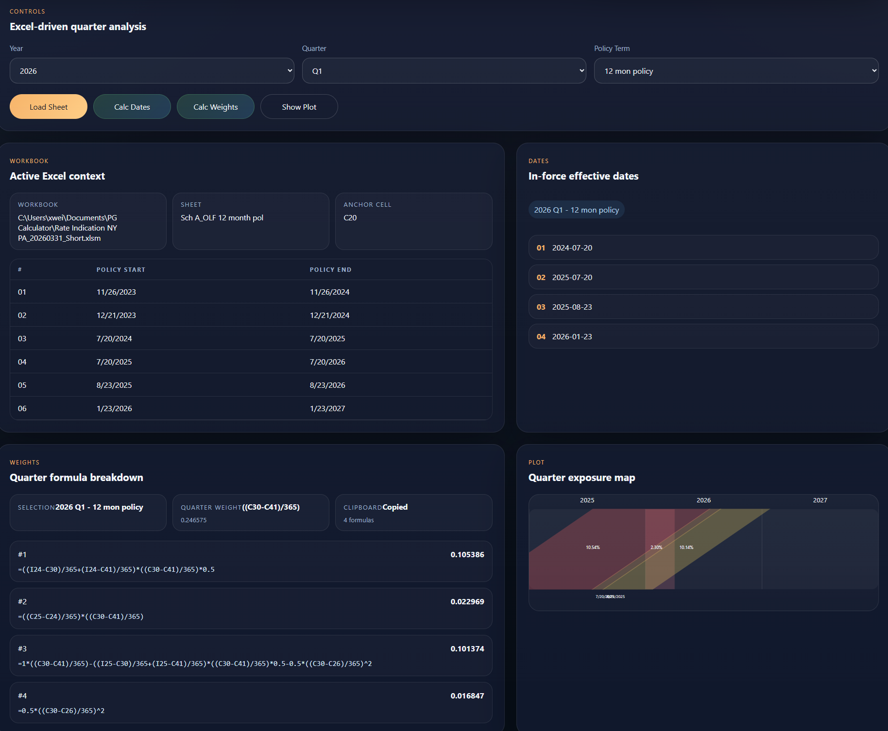

# OLEP Calculator

Desktop tool for generating quarter weights and visualizing on-level factor calculations.



## Who This Is For

This tool is intended for actuarial and ratemaking users who perform on-level calculations in spreadsheets, especially teams that do not have access to vendor software and have built their own spreadsheet-based process.

## Background

The original app was developed in 2022. The initial motivation for this app was to create a more automated OLEP calculation workflow for spreadsheet-based users. It is an enhancement to manual OLF calculations, keeping the familiar workbook-driven process while reducing repetitive manual steps and making quarter weight generation easier to review and reuse. The core calculation algorithm has been verified extensively in production use. The current build keeps the same core calculation behavior while presenting it through a refactored, modernized UI.

## Current Limitations

- For 6-month policies that span a leap year, the calculation can show slight rounding variance because the current logic does not account for 366-day years.

## Overview

This project wraps the existing Excel-based calculation workflow in a desktop app built with:

- Python for workbook inspection and calculation logic
- FastAPI for the local app API
- React + Vite for the user interface
- PyWebView for the desktop window shell

The app is designed to work directly with spreadsheets and supports the typical on-level factor workflow:

1. It reads the currently active Excel workbook, worksheet, and selected date header cell, then generates quarter weights for on-level factors based on policy effective dates and policy term.
2. It plots the quarter parallelogram so users can see the weight contribution for each rate level visually.

In practice, the app helps users:

- inspect effective date ranges from the active workbook
- calculate in-force dates for a selected quarter
- generate quarter weight formulas and numeric results
- copy formula output to the clipboard
- visualize the quarter exposure map for each rate level

## Example Workflow

1. Open the target workbook in Excel and select the policy effective date header cell.
2. Inspect the workbook to confirm the detected date ranges and anchor location.
3. Choose the target quarter and policy term.
4. Generate quarter weights and copy the resulting formulas.
5. Review the quarter parallelogram plot to see the weight contribution by rate level.

## Requirements

- Windows
- Python 3.13
- Node.js
- Microsoft Excel installed
- An active, saved Excel workbook open in Excel

## Setup

### Python

```powershell
.\.venv\Scripts\Activate.ps1
python -m pip install -r requirements.txt
```

If `.venv` does not exist yet:

```powershell
python -m venv .venv
.\.venv\Scripts\Activate.ps1
python -m pip install -r requirements.txt
```

### Frontend

```powershell
cd frontend
npm install
npm run build
cd ..
```

`main.py` serves the built frontend from `frontend/dist`, so the build step is required before launching the desktop app.

## Run

1. Open Microsoft Excel.
2. Open the target workbook and save it if it has not been saved yet.
3. Go to the target worksheet and select the date header cell.
4. Start the app:

```powershell
.\.venv\Scripts\Activate.ps1
python main.py
```

## Project Layout

```text
backend/              FastAPI app, Excel session access, and calculation logic
frontend/             React/Vite UI source and build output
docs/images/          README assets
main.py               Desktop entrypoint that starts the local server and PyWebView window
requirements.txt      Python dependencies
README.md             Project documentation
```

## Notes

- The app version is defined in `backend/version.py`.
- The desktop icon and favicon are stored at `frontend/public/favicon.ico`.
- If the UI says the frontend build is missing, run `npm install` and `npm run build` inside `frontend`.
